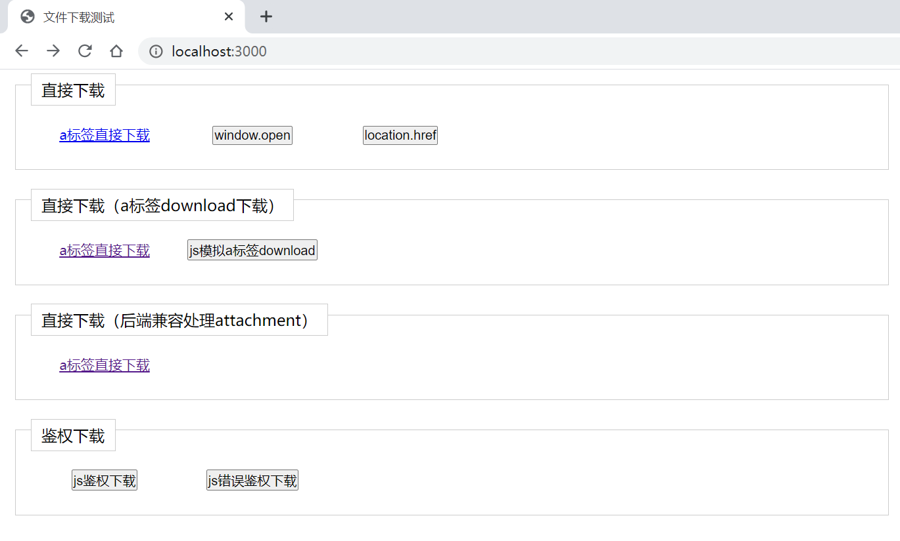

# 前端文件下载的几种方式


前端开发中，经常遇到文件下载的功能。这里对常见的文件下载方式做一些总结。


## 一、直接下载

针对一些浏览器无法识别的文件格式。可以直接在地址栏上出入URL即可触发浏览器的下载功能。

同类的还有window.location.href、window.open

* 地址栏输入文件URL
* window.location.href = URL
* window.open(URL)


## 二、直接下载（使用a标签download属性）

直接下载仅使用的浏览器无法识别的文件。如果是浏览器支持的文件格式（如：html、jpg、png）等。则不会触发文件下载，而是被浏览器直接触发解析展示。

针对这种情况，我们可以使用a标签的download属性，可以设置文件名。

写法如下：

```html
<a href="/images/download.jpg" download="myFileName">
```

开发中，我们遇到的还有一部分场景是js直接触发下载，也是相同的做法，我们可以手动写一个a标签。appen到body里边，触发下载之后，将其remove

示例如下（生产环境注意各浏览器事件的兼容性写法）：

```javascript
const download = (filename, link) => {
	let DownloadLink = document.createElement('a'); 
    DownloadLink.style = 'display: none'; // 创建一个隐藏的a标签
    DownloadLink.download = filename;
    DownloadLink.href = link;
    document.body.appendChild(DownloadLink);
    DownloadLink.click(); // 触发a标签的click事件
    document.body.removeChild(DownloadLink);
}
```

*生产环境可以使用我封装的itools.js中的download方法。*


## 三、直接下载（后端兼容处理attachment）

有很多场景。有些浏览器可识别的文件格式，我们还是需要直接下载的情况（如：用户直接分享的下载pdf、txt；很多浏览器也是支持展示的）。

这种情况下，我们需要声明一下文件的header的 Content-Disposition信息。告诉浏览器，该链接为下载附件链接，并且可以声明文件名（方式二也可以下载该类型文件，不过文件名会以header设置的文件名优先）。

写法如下：

```
Content-Disposition: attachment; filename="filename.xls" 
```


**同类的方法还有将文件作为outstream返回**


## 四、鉴权下载

在部分场景中，有一些文件，需要用户登录之后根据权限来开放下载（报表等）。

此时，我们需要将本地的用户信息传给服务端。常用的方式如：在header增加token。

这里我们需要使用XmlHttpRequest来想后台发起请求。并带上header信息，获取到文件数据之后，在使用下载方法。

axios示例如下：

```javascript
axios({
    method:'get',
    url: '/download/file.doc'
    responseType: 'blob',
    headers: {
    	Authorization: '123456'
	}
}).then(res => {
    let fileUrl = window.URL.createObjectURL(res.data)
    iTools.download('filename',fileUrl) // 方法二使用到的a标签download方式。
    window.URL.revokeObjectURL(fileUrl)
})
```


**原生写法自己可以百度一下**


## 其他

以上就是常用的文件形式，不过在使用上这些形式还能有其他的使用形式。

* 使用iframe来下载一类型
* 使用post提交表单来做鉴权


## 测试代码


测试代码仓库地址：
```
git clone https://github.com/shb190802/front-end-file-download.git
cd front-end-file-download
npm install
node app.js
// 浏览器打卡 http://localhost:3000
```


